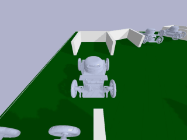

# RL parking

[English](https://github.com/Fan-Treasure/Auto-Parking/blob/main/RL_parking/README.md) | [简体中文](https://github.com/Fan-Treasure/Auto-Parking/blob/main/RL_parking/README_cn.md)

## Introduction

Shandong University, Weihai Class of 2020 Data Science and Artificial Intelligence Experimental Class Computer Vision Project Part II: Reinforcement Learning Simulated Parking and Real Parking

This project is divided into two parts:

1. Implement a simulated Ackermann structured car reversing into the parking lot based on the DQN algorithm, the reinforcement learning algorithm is implemented using stable-baselines3, the car and reversing environment is implemented based on pybullet, gym and Solidworks.
2. Deploying the model on a real Ackermann structured car and using Arduino to control the car to reverse into garage.

## Part 1  Reinforcement learning simulated parking

### Simulating environments

We used Solidworks to design the Ackermann structural four-wheeled car and a map containing two vertical garages, two sloping garages, one side garage and one irregular garage. Then we exported the urdf file and built the environment via pybullet and gym.

#### Ackermann structured car


#### Map


### Tasks

#### 1. Vertical reversing into a vertical garage

- Target: The car departs from the front of the parking space, the direction of the front of the car is aligned with the direction of the parking space, the reversing process cannot collide with the wall to achieve vertical reversing into the parking space.
- result: 




#### 2. Sideways vertical reversing into a vertical garage

- Target: The car starts from a diagonal above the parking space, the direction of the front of the car is perpendicular to the parking space, and the reversing process cannot collide with the wall to achieve reversing into the parking space.
- result: 


#### 3. Diagonal reversing into a diagonal garage

- Target: The car starts from the front of the parking space, the direction of the front of the car is at a certain angle to the parking space, the reversing process can not collide with the wall and the car next to the parking space, to achieve reversing into the parking space.
- result: 


#### 4. Sideways vertical reversing into a vertical garage placed at an angle

- Target: The vertical garage is placed at an angle, with the car starting from the top right of the garage, the direction of the front of the car is perpendicular to the parking space, and the reversing process cannot collide with the wall to achieve reversing into the garage.
- result: 


#### 5. Sideways parallel reversing into a side garage

- Target: The car reverses into the garage from in front of the parking space with the front direction parallel to the parking space and without colliding with the wall during the reversing process.
- result: 


#### 6. Reversing into the sloping garage from any position

- Target: The car starts from any point, the direction of the front end is random, and the reversing process cannot collide with the wall or the car next to the parking space to achieve reversing into the parking space.
- result: 


#### 7. Sideways reversing into an irregular garage

- Target: The shape and position of the garage is irregular, the car starts from the bottom left of the garage, the direction of the car's head makes a certain angle with the parking space, and the reversing process cannot collide with the wall to achieve reversing into the garage.
- result: 


#### 8. Reversing sideways into a sloping garage

- Target: The car goes from the bottom right of the parking space, the direction of the front of the car is perpendicular to the parking space, the reversing process can not collide with the wall and the car next to the parking space, to achieve reversing into the parking space.
- result: 


### RL Definition

#### 1. Observation

We define the centre point of the environment as [0, 0] and use the pybullet to get the coordinates, speed and direction of the  in real time as the current state of the car.

The state is a 6-dimensional vector of the x-coordinate, y-coordinate, x-directional linear velocity, y-directional linear velocity, cosine of the angle with the x-direction, and cosine of the angle with the y-direction of the car.


#### 2. Action

The car can perform 4 movements: forward, backward, left turn and right turn, using pybullet to simulate the movement of the car in the environment.


#### 3. Reward

For most state-action pairs, we define reward as follows.


Define $reward = -500$ when a car collides with a wall or another car.


#### 4. Episode

We set the episode length to 500, but terminate the episode when the car collides with a wall or another car.


### Install

- Clone this project

```shell
git clone https://github.com/Fan-Treasure/Auto-Parking.git
```

- Go to the project directory

```shell
cd RL_parking/RL_parking-main
```

- Install environments

```shell
pip install -e parking_env
```


### Train

#### 1. Training with the DQN algorithm

In terms of algorithms, we have chosen the classical algorithm for discrete action spaces, Deep Q Network (DQN), an off-policy reinforcement learning algorithm based on Q-learning, which uses a replay buffer to store the experience gained by an intelligence exploring the environment.

We use the best open source library in the field of reinforcement learning, stable-baselines3, to train reinforcement learning intelligences in 10 lines of code. At the same time, stable-baselines3 supports a vectorised environment, which makes training fast. Tasks 1-5 were trained with 2 million steps and task 6 with 5 million steps.

The training process reveals that the car has a high probability of exploration in the early stage, and it keeps trying to learn based on the trial and error experience in the environment. Later on, the car's exploration rate decreases and it is able to complete the parking process with a high success rate. Task 2 After 1.5 million steps, the car basically achieves the effect that it can park in the target parking space from any point.

##### Training commands for each task

- Task 1: Vertical reversing into a vertical garage

```shell
python train.py --mode=1
```

- Task 2: Sideways vertical reversing into a vertical garage

```shell
python train.py --mode=2
```

- Task 3: Reversing diagonally into a diagonal garage

```shell
python train.py --mode=3
```

- Task 4: Vertical reversing into an inclined placed vertical garage

```shell
python train.py --mode=4
```

- Task 5: Sideways parallel reversing into a side garage

```shell
python train.py --mode=5
```

- Task 6: Reversing into the sloping garage from any position

```shell
python dgn_agent.py --mode=6
```

- Task 7: Reversing sideways into an irregular garage

```shell
python train.py --mode=5
```

- Task 8: Reversing sideways into a diagonal garage

```shell
python dgn_agent.py --mode=6
```


#### 2. Training with SAC and HER algorithms (using the highway-env environment)

```shell
python sac_her_agent.py
```


#### 3. Visualization Curves using Tensorboard

##### Take Task 2 as an example

- mean episode reward


- success rate


### Evaluate

```shell
# Specify mode and ckpt_path
python evaluate.py --mode=mode --ckpt_path=ckpt_path
```


### Play in the environment

```shell
python play.py
```


### Render videos

#### 1. Car testing videos

```shell
# Specify mode and ckpt_path
python render_video.py --mode=mode --ckpt_path=ckpt_path
```


#### 2. Car training videos

```shell
# Specify mode and ckpt_path
python render_training_video.py --mode=mode --ckpt_path=ckpt_path
```


#### 3. Environment videos

```shell
# Specify mode
python render_env_video.py --mode=mode
```


## Part 2  Real car auto-parking

### Map

We first designed a map of the actual parking based on the simulated environment, with the same number, type and location of garages as in the simulated environment.


### Methods

1.  Fix the camera to the camera mount to capture the entire map and the car. The car is identified by taking a live picture of the camera, adding an anchor frame to the identified car using the car recognition model trained in the previous phase and obtaining the coordinates of the apex of the anchor frame to localise the car. The anchor frame is then placed into the car orientation detection model trained in the previous stage to predict the orientation of the car.


2. Once the car's position information has been obtained, the environment information, model path and reversing mode of the map are specified and the model file for the corresponding mode can be invoked to plan the trajectory for the automatic parking. A total of eight reversing modes are trained for use in the training process. After the call, the car's next target orientation and speed information is obtained and transmitted back to the car using communication. The car's servo and motor are controlled according to the change in target angle and speed, and the relevant functions are called and the parameters specified to control the car's movement.

   

   

3. During the movement of the car, the camera takes pictures and continuously calls up the model recognition, which continuously sends back motion commands to the car to control the automatic parking process.


### Steps

1. Print the map and lay it flat on the ground. Connect the camera to the computer and mount the camera using the phone mount so that the camera can capture the entire map image clearly.

3. Program `Real_parking\server_without_html\server_without_html.ino` for the car's main board, **Note that the hardware is connected according to the serial port number in the program, otherwise the car will not run properly. **

4. Run `Real_parking\real_parking.py` locally

5. Place the car on the main map road and switch on the battery for automatic parking.

   

### Results


#### 1. Inclined garage reversing


#### 2. Sideways garage reversing


## Links

[[Baidu AI Studio]Car Detection Model Training  based on PP-YOLOv2](https://aistudio.baidu.com/aistudio/projectdetail/4918206) 

[[Baidu AI Studio]Orientation Detection Model Training](https://aistudio.baidu.com/aistudio/projectdetail/4885428) 

[[Github]Road Segmentation and Autonomous Driving](https://github.com/xujialuu/self-driving-car)

[[Github]Car Orientation Detection](https://github.com/Fan-Treasure/Auto-Parking/tree/main/Car-Orientation-Detection)

[[Bilibili]Explanation Video of Car Orientation Detection](https://www.bilibili.com/video/BV1YM41167Dy) 

[[Bilibili]Explanation Video of RL parking](https://www.bilibili.com/video/BV1fD4y1j7KM/) 
