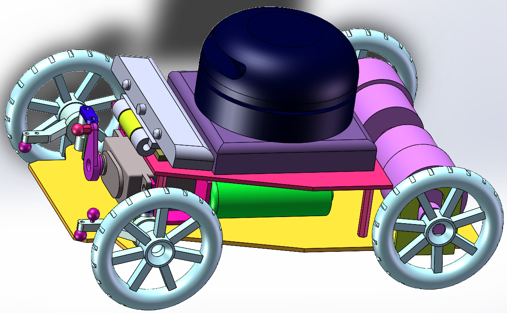
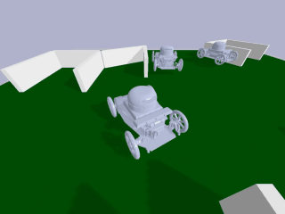
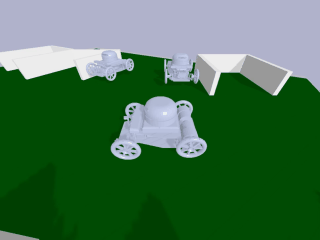
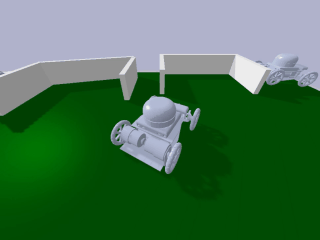
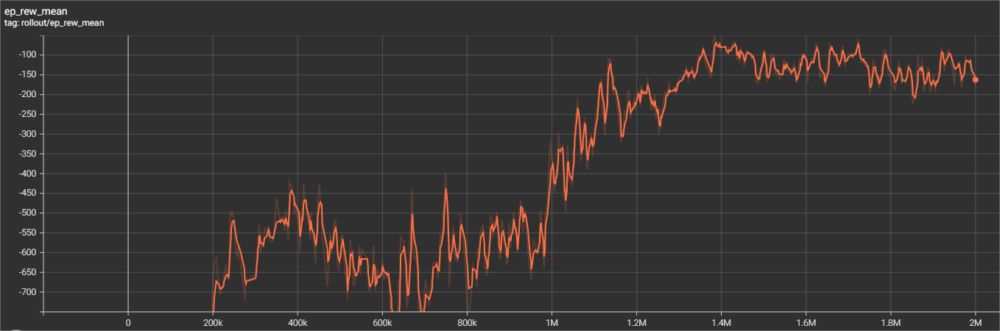

# 强化学习自动泊车

[English](https://github.com/Fan-Treasure/Auto-Parking/blob/RL-Parking/README_en.md) | [简体中文](https://github.com/Fan-Treasure/Auto-Parking/blob/RL-Parking/README_cn.md)

## 简介

山东大学（威海）2020级数科班计算机视觉（1）大作业第二部分：强化学习模拟泊车+实际泊车

本项目分为两部分

1. 基于DQN算法实现模拟阿克曼结构小车倒车入库，强化学习算法使用stable-baselines3实现，小车和倒车环境基于pybullet、gym、Solidworks实现。

2. 在真实阿克曼结构小车上部署模型，使用Arduino控制小车倒车入库。

## Part 1  强化学习模拟泊车

### 模拟环境

我们使用Solidworks设计了阿克曼结构四轮小车以及包含2个竖直车库、2个斜车库、1个侧方车库、1个不规则车库的地图，导出urdf文件并通过pybullet与gym搭建环境。

#### 阿克曼小车



#### 地图


### 任务

#### 1. 垂直倒车进入竖直库

- 目标：小车从车位前出发，车头方向与车位方向对齐，倒车过程中不能碰撞墙壁，实现垂直倒车入库。
- 效果：


#### 2. 侧方位-垂直倒车进入竖直库

- 目标：小车从车位斜上方出发，车头方向与车位垂直，倒车过程中不能碰撞墙壁，实现倒车入库。
- 效果：


#### 3. 斜方位-倒车进入斜库

- 目标：小车从车位前出发，车头方向与车位成一定夹角，倒车过程中不能碰撞墙壁和车位旁的小车，实现倒车入库。
- 效果：




#### 4. 侧方位-垂直倒车进入倾斜放置的竖直库

- 目标：竖直库倾斜放置，小车从车库右上方出发，车头方向与车位垂直，倒车过程中不能碰撞墙壁，实现倒车入库。
- 效果：




#### 5. 侧方位-平行倒车进入侧方库

- 目标：小车从车位前，车头方向与车位平行，倒车过程中不能碰撞墙壁，实现倒车入库。
- 效果：




#### 6. 任意位置出发倒车进入斜库

- 目标：小车从任意点出发，车头方向随机，倒车过程中不能碰撞墙壁和车位旁的小车，实现倒车入库。
- 效果：


#### 7. 侧方位-倒车进入不规则车库

- 目标：车库形状与位置不规则，小车从车库左下方出发，车头方向与车位成一定夹角，倒车过程中不能碰撞墙壁，实现倒车入库。
- 效果：


#### 8. 侧方位-倒车进入斜库

- 目标：小车从车位右下方，车头方向与车位垂直，倒车过程中不能碰撞墙壁和车位旁的小车，实现倒车入库。
- 效果：


### 强化学习

#### 1. 状态

我们定义环境中心点为 [0, 0]，使用pybullet实时获取小车的坐标、速度和方向等信息，作为小车当前的状态。

状态是一个6维向量，分别为小车的x坐标、y坐标、x方向线速度、y方向线速度、与x方向夹角余弦值、与y方向夹角余弦值。


#### 2. 动作

小车可以执行4种动作：前进、后退、左转、右转，使用pybullet在环境中模拟小车的运动。


#### 3. 奖励

对于大部分状态-动作对，我们定义如下 reward：


当小车碰撞到墙壁、其他小车，或者运动到地图之外时，定义 reward = -1000。


#### 4. 回合

我们设定回合长度为2000，但当小车碰撞到墙壁或其他小车时，终止回合。


### 本地部署

- 克隆本项目

```shell
git clone https://github.com/Fan-Treasure/Auto-Parking.git
```

- 进入项目目录

```shell
cd RL_parking/RL_parking-main
```

- 安装停车环境（会同时安装gym、pybullet、stable-baselines3、torch、moviepy等第三方库）

```shell
pip install -e parking_env
```


### 训练

#### 1. 使用 DQN 算法训练

在算法方面，我们选择了适用于离散动作空间的经典算法——DQN (Deep Q Network)。DQN是一种基于Q-learning的off-policy强化学习算法，使用replay buffer存放智能体在环境中探索得到的经验。

我们使用强化学习领域目前最为优秀的开源库stable-baselines3进行训练，10行代码即可训练强化学习智能体。同时，stable-baselines3支持向量化环境，训练速度较快。其中，任务1-5和7-8训练了2百万步，任务6训练了5百万步。

通过训练过程可以发现，前期小车有较高的探索概率，在环境中不断试错，根据试错经验进行学习，后期小车探索率降低，能够以较高的成功率完成停车过程。任务2在150万步后，小车基本上达到了从任意点出发都可以停到目标车位的效果。

##### 各任务训练命令

- 任务1：垂直倒车进入竖直库

```shell
python train.py --mode=1
```

- 任务2：侧方位-垂直倒车进入竖直库

```shell
python train.py --mode=2
```

- 任务3：斜方位-倒车进入斜库

```shell
python train.py --mode=3
```

- 任务4：垂直倒车进入倾斜放置的竖直库

```shell
python train.py --mode=4
```

- 任务5：侧方位-平行倒车进入侧方库

```shell
python train.py --mode=5
```

- 任务6：任意位置出发倒车进入斜库

```shell
python dgn_agent.py --mode=6
```

- 任务7：侧方位-倒车进入不规则车库

```shell
python train.py --mode=5
```

- 任务8：侧方位-倒车进入斜库

```shell
python dgn_agent.py --mode=6
```


#### 2. 使用 SAC 和 HER 算法训练（使用 highway-env 环境）

```shell
python sac_her_agent.py
```


#### 3. Tensorboard 可视化曲线

##### 以任务2为例

- 回合平均奖励



- 成功率


### 测试

```shell
# 需指定 mode 和 ckpt_path
python evaluate.py --mode=mode --ckpt_path=ckpt_path
```


### 渲染模拟环境

```shell
python play.py
```


### 渲染视频

#### 1. 小车测试视频

```shell
# 需指定 mode 和 ckpt_path
python render_video.py --mode=mode --ckpt_path=ckpt_path
```


#### 2. 小车训练视频

```shell
# 需指定 mode 和 ckpt_path
python render_training_video.py --mode=mode --ckpt_path=ckpt_path
```


#### 3. 环境视频

```shell
# 需指定 mode
python render_env_video.py --mode=mode
```


## Part 2  真实小车自动泊车

### 地图

我们首先基于模拟环境设计了实际泊车的地图，车库数量、类型、位置均与模拟环境中相同。


### 原理

1.  将摄像头固定在摄像头支架上拍摄整个地图以及小车，通过对摄像头实时拍摄得到的照片进行识别，使用前一阶段训练好的小车识别模型为识别出的小车添加锚框并得到锚框的顶点坐标来实现对小车的定位，然后再将添加锚框后的图片放入前一阶段训练好的汽车朝向检测模型进行预测以得到小车的朝向。


2. 获得了小车的位姿信息后，指定地图的环境信息、模型路径以及倒车模式，即可调用相应模式的模型文件为小车自动泊车进行轨迹规划。在训练过程中一共训练了8种倒车模式以供使用。调用后会得到小车接下来的目标朝向信息和速度信息，利用通信传回小车内部，根据目标角度的变化以及速度的变化来控制小车的舵机以及电机，调用相关函数并指定其中的参数来实现对小车运动的控制。

   
   
   
   
3. 在小车的运动过程中，摄像头会不断拍摄图片并不断调用模型识别，持续为小车传回运动指令即可实现小车自动泊车过程的控制。


### 步骤

1. 打印地图，平铺在地面上，将摄像头连接电脑并利用手机支架安装摄像头，使摄像头能清晰地拍到整个地图画面。

3. 为小车主板烧录`Real_parking\server_without_html\server_without_html.ino`，**注意根据程序中的串口号连接硬件，否则小车无法正常行驶。**

4. 在本地运行`Real_parking\real_parking.py`

5. 将小车放置地图主路上，打开电池开关即可进行自动泊车。

   

### 效果展示


#### 1.斜库倒车


#### 2.侧方入库


## 链接

[[百度AI Studio]基于PP-YOLOv2的小车识别](https://aistudio.baidu.com/aistudio/projectdetail/4918206)

[[百度AI Studio]小车方向检测](https://aistudio.baidu.com/aistudio/projectdetail/4885428)

[[Github]小车道路分割与自动驾驶](https://github.com/xujialuu/self-driving-car)

[[Github]小车识别及方向检测](https://github.com/Fan-Treasure/Auto-Parking/tree/main/Car-Orientation-Detection)

[[哔哩哔哩]小车识别与方向检测讲解视频](https://www.bilibili.com/video/BV1YM41167Dy) 

[[哔哩哔哩]强化学习自动泊车讲解视频](https://www.bilibili.com/video/BV1fD4y1j7KM/) 